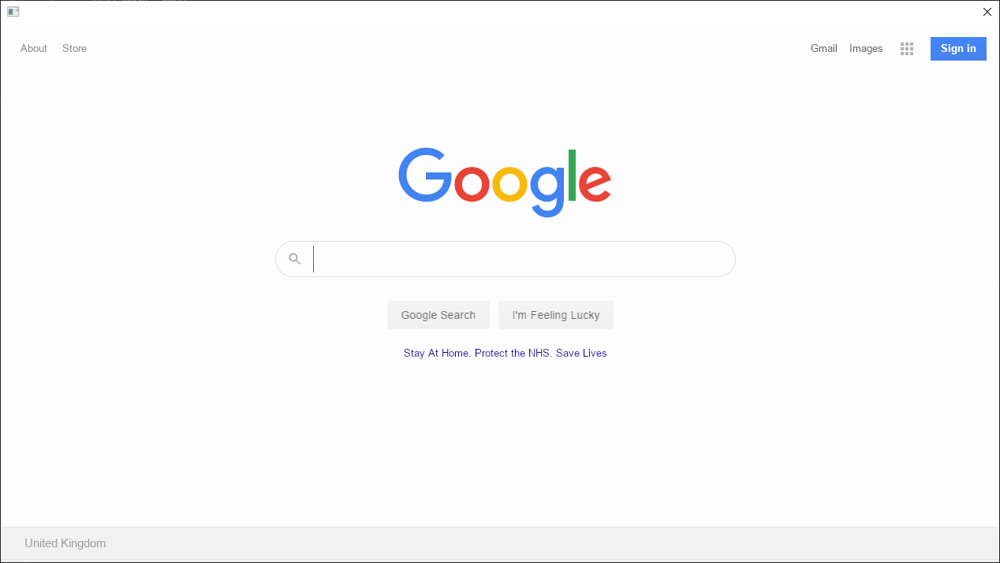

# Build result

# Building
- Clone this repo
- Download the [Ultralight API](https://github.com/ultralight-ux/Ultralight/releases) for your platform, and place its contents in a folder next to this file called "ultralight"
- Run `zig build`
- Place the dynamic libraries from `ultralight/bin` next to the executable and run it